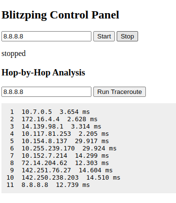

# AF_XDP: High-Performance Socket Usage

AF_XDP is a specialized socket type offered by the Linux kernel for 
zero-copy packet processing. Its key advantage is higher throughput 
and lower latency than traditional sockets.

## Prerequisites
- Linux kernel >= 4.18
- Properly configured network driver
- Sufficient privileges (root) to create and bind AF_XDP sockets

## Compilation
- Ensure the project includes AF_XDP sources (e.g., `af_xdp.c`) at build time.
- If cross-compiling, have arch-specific kernel headers installed.

## Usage
1. Run make in the Blitzping directory
   ```
   make
   ```
2. Launch Blitzping with AF_XDP flags in **Blitzping/out** directory:
   ```
   ./blitzping --af-xdp --dest-ip=<destination-ip>
   ```
3. Use additional command-line options (e.g., `--af-xdp-tcp`) if needed.
4. Consider setting env variables like `HUGETLB_PATH` 
   for optimal large-page memory usage.

## Kernel and NIC Tuning
- Pin CPU cores (`taskset`) for faster packet handling.
- Adjust ring buffer sizes, busy-poll intervals, and driver 
  optimizations (`ethtool`) to maximize throughput.

## Implementation Details in Blitzping
Blitzping initializes an AF_XDP socket (via the Linux kernel’s XDP/eBPF 
infrastructure) to allow minimal copy operations between user and kernel space. 
It sets up the XDP rings for RX/TX and binds them to the specified interface 
and queue ID, bypassing traditional socket layers.

## Integrating an External XDP Program
Users can preload or attach their own eBPF (XDP) programs prior to running 
Blitzping. For example:
1. Compile and load your custom XDP program with “ip link set dev <ifname> xdp obj <prog> sec <section>”.
2. Verify your program’s attachment using “ip -details link show <ifname>”.
3. Launch Blitzping with “--af-xdp <ifname> <queue_id>” to use the same XDP hook.

Blitzping will detect that XDP is already bound to the interface and seamlessly 
integrate with your eBPF logic for passing packets through the AF_XDP queue.

## Detailed AF_XDP Explanation
- **Zero-Copy Buffers**: AF_XDP maps rings directly to user space for sending 
  or receiving packets without extra kernel copying.
- **Performance Gains**: By avoiding overhead from the normal TCP/IP stack, 
  AF_XDP can transmit higher packet rates with lower latency.
- **Driver Requirements**: Network drivers must support XDP “offload” or 
  “native” modes. If unavailable, the “generic” fallback might still work 
  but yields less performance.

## Traditional Sockets vs AF_XDP

### Traditional Socket Architecture
Traditional socket implementations in Linux follow this path:
```
Application -> Socket API -> Protocol Stack -> Generic Driver -> NIC
```

This design involves multiple data copies and context switches:
1. NIC DMA transfers packet to kernel memory
2. Kernel copies packet to socket buffer
3. Application reads data from socket (kernel-to-userspace copy)

These copies add significant overhead for high-performance applications.

### AF_XDP Socket Architecture
AF_XDP creates a more direct path:
```
Application -> AF_XDP Socket -> XDP Program -> Driver -> NIC
```

Key advantages:
- Zero or single copy operation depending on driver support
- Bypass of protocol stack for raw packet handling
- Memory mapped ring buffers for efficient data sharing
- Reduced context switching between user and kernel space

## Technical Implementation in Blitzping

Blitzping's AF_XDP implementation is structured in these main components:

1. **UMEM Setup**
   ```c
   /* Create the UMEM region for zero-copy packet handling */
   xsk->umem_area = aligned_alloc_with_hugepages(CHUNK_SIZE, UMEM_SIZE);
   struct xdp_umem_reg umem_reg = {
       .addr = (uintptr_t)xsk->umem_area,
       .len = UMEM_SIZE,
       .chunk_size = CHUNK_SIZE,
       .headroom = 0,
   };
   setsockopt(xsk->fd, SOL_XDP, XDP_UMEM_REG, &umem_reg, sizeof(umem_reg));
   ```

2. **Ring Buffer Configuration**
   ```c
   /* Configure ring sizes for optimal performance */
   int ring_size = RING_SIZE;
   setsockopt(xsk->fd, SOL_XDP, XDP_RX_RING, &ring_size, sizeof(ring_size));
   setsockopt(xsk->fd, SOL_XDP, XDP_TX_RING, &ring_size, sizeof(ring_size));
   setsockopt(xsk->fd, SOL_XDP, XDP_UMEM_FILL_RING, &ring_size, sizeof(ring_size));
   setsockopt(xsk->fd, SOL_XDP, XDP_UMEM_COMPLETION_RING, &ring_size, sizeof(ring_size));
   ```

3. **Memory Mapping Ring Buffers**
   ```c
   /* Map the rings to userspace memory */
   xsk->rx.map = mmap(NULL, 
                    off.rx.desc + RING_SIZE * sizeof(struct xdp_desc),
                    PROT_READ | PROT_WRITE, 
                    MAP_SHARED | MAP_POPULATE,
                    xsk->fd, XDP_PGOFF_RX_RING);
   ```

4. **Frame Pool Management**
   ```c
   /* Create and initialize pool of frames for packet handling */
   xsk->frame_pool = umem_allocator_create(CHUNK_COUNT, CHUNK_SIZE);
   ```

5. **Binding to Interface**
   ```c
   /* Bind the socket to specific interface and queue ID */
   struct sockaddr_xdp addr = {
       .sxdp_family = AF_XDP,
       .sxdp_ifindex = xsk->ifindex,
       .sxdp_queue_id = xsk->queue_id,
       .sxdp_flags = XDP_ZEROCOPY /* Falls back to XDP_COPY if unsupported */
   };
   bind(xsk->fd, (struct sockaddr *)&addr, sizeof(addr));
   ```

## Detailed XDP Program Integration

### Step-by-Step Integration Guide

1. **Write an XDP Program in BPF-C**
   
   Create a file `custom_redirect.c`:
   ```c
   #include <linux/bpf.h>
   #include <bpf/bpf_helpers.h>
   
   SEC("xdp")
   int redirect_func(struct xdp_md *ctx)
   {
       /* Your packet filtering/processing logic */
       
       /* Redirect to userspace via AF_XDP socket */
       return bpf_redirect_map(&xsks_map, ctx->rx_queue_index, XDP_PASS);
   }
   
   /* Map to hold AF_XDP socket references */
   struct {
       __uint(type, BPF_MAP_TYPE_XSKMAP);
       __uint(max_entries, 64);
       __uint(key_size, sizeof(int));
       __uint(value_size, sizeof(int));
   } xsks_map SEC(".maps");
   
   char LICENSE[] SEC("license") = "GPL";
   ```

2. **Compile the XDP Program**
   ```bash
   clang -O2 -target bpf -c custom_redirect.c -o custom_redirect.o
   ```

3. **Load the XDP Program**
   ```bash
   ip link set dev eth0 xdp obj custom_redirect.o sec xdp
   ```

4. **Update the BPF Map with Socket Reference**
   ```bash
   # After starting Blitzping, get the map and update it
   QUEUEID=0
   MAP_ID=$(bpftool map list | grep xsks_map | awk '{print $1}')
   XSK_FD=$(cat /proc/$(pidof blitzping)/fdinfo/* | grep -i xdp | awk '{print $5}' | head -1)
   bpftool map update id $MAP_ID key $QUEUEID value $XSK_FD
   ```

5. **Run Blitzping with AF_XDP Mode**
   ```bash
   ./blitzping --af-xdp eth0 0
   ```

### Advanced Integration Examples

1. **XDP-based Load Balancer with Blitzping**
   ```bash
   # 1. Load custom XDP program that distributes packets across queues
   ip link set dev eth0 xdp obj lb_xdp.o sec xdp
   
   # 2. Start multiple Blitzping instances, each on a different queue
   ./blitzping --af-xdp eth0 0 &
   ./blitzping --af-xdp eth0 1 &
   ./blitzping --af-xdp eth0 2 &
   ./blitzping --af-xdp eth0 3 &
   
   # 3. Update the XDP map with all socket references
   # (This step would be automated in a production setup)
   ```

2. **Packet Filter + Blitzping**
   ```bash
   # 1. Load custom XDP program that filters specific traffic
   ip link set dev eth0 xdp obj packet_filter.o sec xdp
   
   # 2. Start Blitzping to process only the filtered packets
   ./blitzping --af-xdp eth0 0 --process-mode
   ```

3. **Hardware Offload Integration**
   ```bash
   # Enable hardware offload if supported by NIC
   ip link set dev eth0 xdp obj offload_prog.o sec xdp xdpdrv
   
   # Run Blitzping with appropriate settings
   ./blitzping --af-xdp eth0 0 --hw-offload
   ```

## Architecture Diagram

```
┌─────────────────┐     ┌───────────────┐     ┌────────────────┐
│                 │     │               │     │                │
│    Blitzping    │◄───►│    AF_XDP     │◄───►│   XDP Program  │
│   Application   │     │    Socket     │     │                │
│                 │     │               │     │                │
└─────────────────┘     └───────────────┘     └────────────────┘
        │                      │                      │
        │                      │                      │
        ▼                      ▼                      ▼
┌─────────────────────────────────────────────────────────────┐
│                                                             │
│                        Linux Kernel                         │
│                                                             │
└─────────────────────────────────────────────────────────────┘
                               │
                               │
                               ▼
┌─────────────────────────────────────────────────────────────┐
│                                                             │
│                      Network Interface                      │
│                                                             │
└─────────────────────────────────────────────────────────────┘
```

## Common Troubleshooting

1. **Error: Failed to bind AF_XDP socket**
   - Check if interface exists and queue ID is valid
   - Verify kernel supports AF_XDP (kernel version ≥ 4.18)
   - Ensure program has CAP_NET_ADMIN capability (run as root)

2. **Performance is lower than expected**
   - Check if driver supports native XDP mode with `ip link show`
   - Use `ethtool -i <interface>` to verify driver version
   - Try `HUGETLB_PATH=/path/to/hugepages` environment variable
   - Increase ring buffer sizes in the source code

3. **XDP program doesn't redirect to AF_XDP socket**
   - Verify map update was successful with `bpftool map dump id <map_id>`
   - Check XDP program is attached with `ip link show dev <interface>`
   - Ensure queue IDs match between XDP program and Blitzping

## Additional Tips
- Combine AF_XDP with CPU pinning (e.g., taskset) to maximize throughput.
- Use extra ring queue IDs (e.g., 1, 2, 3, ...) to scale across multiple cores.
- Monitor ring usage with tools like bpftool or drop counters to avoid oversubscription.

## Additional Examples
Below are some extended usage patterns for AF_XDP in Blitzping:

1. **Capturing and Forwarding Packets**  
   ```
   ./blitzping --af-xdp eth0 0 --af-xdp-forward 
   ```
   This might be used for a scenario where Blitzping captures packets on `eth0` 
   and forwards them to a user-defined destination using a custom eBPF hook.

2. **Using Multiple Queues**  
   ```
   ./blitzping --af-xdp eth1 1 --af-xdp-queues 4
   ```
   This spawns multiple Tx/Rx rings on `eth1` to distribute load across 
   CPU cores. Combine with `taskset` or `numactl` for extra performance gains.

## Performance Scaling
- **Multiple Socket Instances**: Consider running several instances of Blitzping
  with different queue IDs to take advantage of SMP systems.
- **Huge Pages**: Large-page memory can further improve throughput by reducing
  TLB misses, especially under heavy traffic loads.
- **Interrupt Moderation**: Tweak NIC driver interrupt settings to balance 
  CPU usage vs. latency (e.g., `ethtool -C <iface> rx-usecs 64`).

## Conclusion
AF_XDP offers a high-speed approach to packet processing by bridging 
XDP and userland via zero-copy rings. Blitzping natively supports 
and extends these functionalities, letting you integrate external 
XDP programs or quickly craft and dispatch packets without the usual 
socket overhead. By combining kernel, NIC, and CPU optimizations, 
it is possible to achieve top-tier performance for testing, diagnostics, 
or specialized network applications.


# Hop by Hop delay analysis

## Usage
1. Run make in the **mytraceroute** directory
   ```
   make
   ```
2. Run mytraceroute as root
   ```
   sudo ./mytraceroute <IPv4 destination address>
   ```

## Technical background

1. **ICMP (Internet Control Message Protocol)** is used by network devices to send error messages and opera-tional information.

2. The **TTL (Time to Live)** field in an IP packet limits the lifetime of a packet. Every router that forwards the packet decrements this field by 1. If TTL reaches 0, the router sends back an ICMP “Time Exceeded” message.

## Implementation Details

### 1. Loop Over TTL Values

We iterate over TTL values from `1` to `MAX_HOPS` to discover each hop along the path.

```c
for (int ttl = 1; ttl <= MAX_HOPS; ++ttl) {
```

---

### 2. Set the TTL for the Outgoing Packet

Using `setsockopt`, we assign the current TTL to the IP packet. This controls how far the packet can travel.

```c
setsockopt(sockfd, IPPROTO_IP, IP_TTL, &ttl, sizeof(ttl));
```

---

### 3. Construct the ICMP Echo Request Packet

We prepare an ICMP Echo Request packet and fill in its fields. Each request is uniquely identified by the process ID and TTL value.

```c
char packet[PACKET_SIZE];
memset(packet, 0, PACKET_SIZE);
struct icmphdr *icmp = (struct icmphdr *)packet;
icmp->type = ICMP_ECHO;
icmp->code = 0;
icmp->un.echo.id = getpid();
icmp->un.echo.sequence = ttl;
icmp->checksum = checksum(packet, PACKET_SIZE);
```

---

### 4. Record the Send Time

We capture the time before sending the packet to later calculate the round-trip time (RTT).

```c
struct timeval start, end;
gettimeofday(&start, NULL);
```

---

### 5. Send the Packet

We send the ICMP packet to the destination address.

```c
sendto(sockfd, packet, PACKET_SIZE, 0,
       (struct sockaddr *)&dest_addr, sizeof(dest_addr));
```

---

### 6. Wait for a Response

We wait to receive a reply from either an intermediate router (ICMP Time Exceeded) or the destination (ICMP Echo Reply).

```c
char recv_buf[512];
struct sockaddr_in reply_addr;
socklen_t addr_len = sizeof(reply_addr);
int received = recvfrom(sockfd, recv_buf, sizeof(recv_buf), 0,
                        (struct sockaddr *)&reply_addr, &addr_len);
```

---

### 7. Record the Receive Time and Compute RTT

We calculate the round-trip time using the difference between the send and receive timestamps.

```c
gettimeofday(&end, NULL);
double rtt = (end.tv_sec - start.tv_sec) * 1000.0 +
             (end.tv_usec - start.tv_usec) / 1000.0;
```

---

### 8. Handle the Response

If we received a reply, we extract the IP address and print the hop information. If the destination is reached, we break out of the loop.

```c
if (received > 0) {
    char addr_str[INET_ADDRSTRLEN];
    inet_ntop(AF_INET, &(reply_addr.sin_addr), addr_str, sizeof(addr_str));
    printf("%2d  %s  %.3f ms\n", ttl, addr_str, rtt);
    if (strcmp(addr_str, dest_ip) == 0)
        break;
} else {
    printf("%2d  *  (timeout)\n", ttl);
}
```

---

### 9. Loop Continues

This continues until either the destination responds or `MAX_HOPS` is reached.

---

### 10.Makefile
   ```Makefile
   CC = gcc
   CFLAGS = -Wall -O2
   TARGET = mytraceroute
   SRC = traceroute.c

   all: $(TARGET)

   $(TARGET): $(SRC)
      $(CC) $(CFLAGS) -o $(TARGET) $(SRC)

   clean:
	   rm -f $(TARGET)

   ```
---

## Working example

1. Run traceroute to google's DNS server
   ```bash
   sudo ./traceroute 8.8.8.8
   ```

2. Output
   ```bash
   1  10.7.0.5  2.333 ms
   2  172.16.4.4  3.284 ms
   3  14.139.98.1  3.830 ms
   4  10.117.81.253  2.047 ms
   5  10.154.8.137  12.442 ms
   6  10.255.239.170  12.517 ms
   7  10.152.7.214  17.792 ms
   8  72.14.204.62  13.950 ms
   9  142.251.76.27  15.157 ms
   10  142.250.238.203  17.247 ms
   11  8.8.8.8  16.076 ms
   ```

## Running the GUI

1. Install the dependencies
   ```bash
   pip3 install flask
   ```
   or
   ```bash
   sudo apt install python3-flask
   ```

2. Run **app.py** as root
   ```bash
   sudo python3 app.py
   ```

## How the GUI looks
